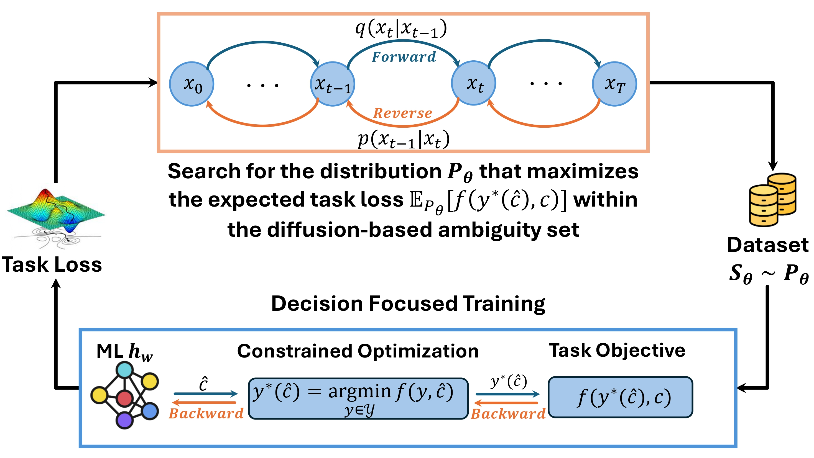

# 3D-Learning: Diffusion-Augmented Distributionally Robust Decision-Focused Learning

**A Case Study on Resource Provisioning for LLM Inference**
---

##  Overview

This repository implements [3D-Learning: Diffusion-Augmented Distributionally Robust Decision-Focused Learning](https://www.arxiv.org/pdf/2602.02943), a framework designed to improve the robustness of Predict-then-Optimize (PTO) pipelines under out-of-distribution (OOD) conditions. The paper has been accepted by **INFOCOM 2026**.

The application is Workload-Aware Resource Provisioning for LLM Inference. With the rapid deployment of AI, particularly large language models (LLMs), the substantial energy costs of AI workloads have become a critical concern. In AI data centers, inference workloads often constitute a large fraction of total computing demand. As LLMs are increasingly adopted, serving systems must process a large volume of LLM inference requests. Given the limited computing capacity and fluctuating demand, data center operators usually need
to provision resources in advance based on predicted workloads. However, the distribution of inference demand can evolve significantly, making it difficult to forecast workloads accurately and to strike an effective balance between energy efficiency and performance guarantees based on the prediction.
We develop a distributionally robust LLM workload predictor focusing on the objectives of serving performance and energy costs

---

<p align="center">
  <a href="Utils/Documents/3D Learning.pdf">
    
  </a>
</p>

<p align="center">
  <em>Figure 1: Overview of the 3D-Learning framework.</em>
</p>


<!--
📄 **Paper link:**  
https://arxiv.org/abs/2510.22757
-->

---

## Features
Specifically, this repository provides:
- Training pipelines for decision-focused learning under distributional robustness
- Diffusion-based generation of adversarial yet realistic worst-case distributions
- End-to-end integration of prediction models and downstream decision objectives
- Experimental evaluation on decision-centric tasks such as LLM resource provisioning

---

##  Environment & Dependencies

### Python Version
- Python **>= 3.9** is recommended (Python **= 3.12.0** is used in our work)

### Core Dependencies

The main dependencies used in this project are:

| Package           | Version        |
|-------------------|----------------|
| matplotlib        | 3.10.8         |
| numpy             | 2.4.0          |
| pandas            | 2.3.3          |
| perlin_noise      | 1.14           |
| Pillow            | 12.1.0         |
| psutil            | 5.9.0          |
| scikit_learn      | 1.8.0          |
| scipy             | 1.16.3         |
| torch             | 2.7.0+cu128    |
| torchvision       | 0.22.0+cu128   |
| torch_fidelity    | 0.3.0          |
| tqdm              | 4.67.1         |

### Dataset

The experiments are conduct based on the dataset of [Azure LLM Inference Traces](https://github.com/Azure/AzurePublicDataset). The dataset captures time series of input and output token counts for each service request in the years 2023 and 2024 from two production-grade LLM inference services deployed within Azure, targeting code-related and conversational tasks, respectively. 


A full list of dependencies is provided in `requirements.txt`.

---

## Installation

### 1. Create and activate a Conda virtual environment

```bash
conda create -n 3d-learning python=3.12.0
conda activate 3d-learning
```
### 2. Install dependencies
```bash
pip install --upgrade pip
pip install -r requirements.txt
```

---

## Run

Please run `main.py` to execute the experiments.

The script is pre-configured with the main experimental settings used in the paper, corresponding to the results reported in **Table 1**.


